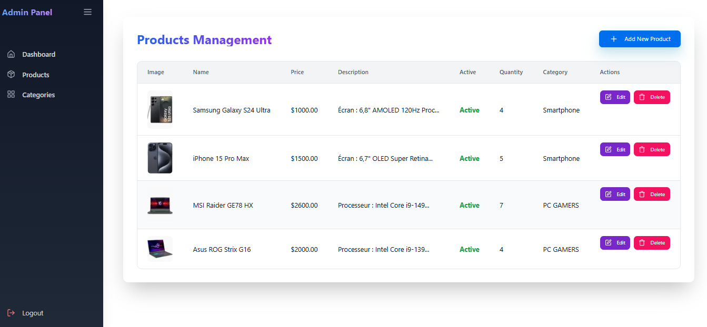
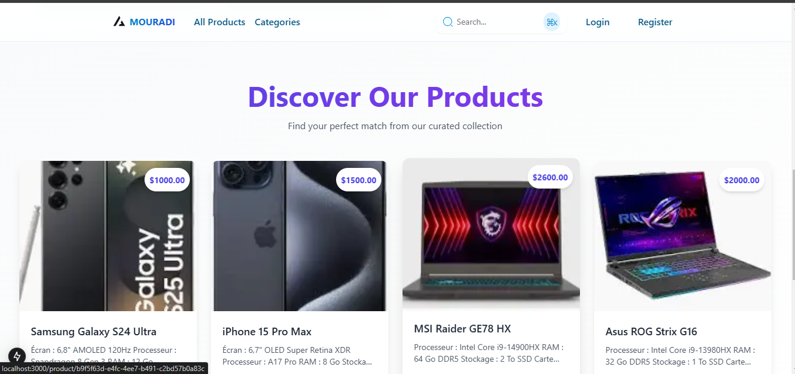
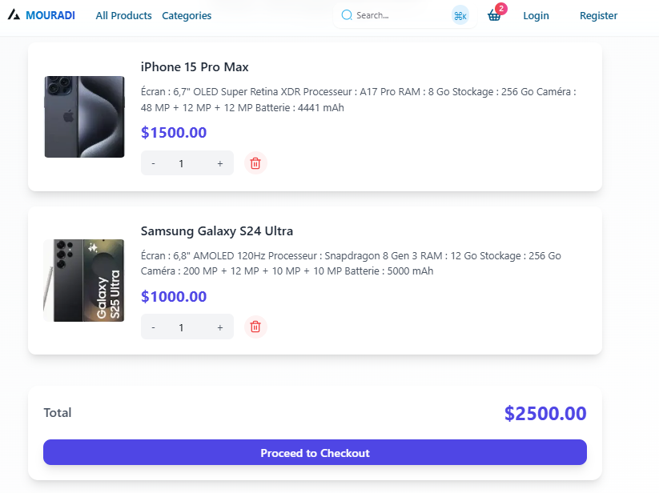

# 🛍️ Modern E-Commerce Platform

[](https://nextjs.org/)
[](https://spring.io/projects/spring-boot)
[](LICENSE)
[](http://makeapullrequest.com)

> A full-stack e-commerce solution with Next.js frontend and Spring Boot backend, featuring modern design and comprehensive features for both customers and administrators.



## ✨ Features

- 🔐 **Secure Authentication**
  - JWT-based authentication
  - Role-based access control (Admin/User)
  - Secure password hashing

- 🛒 **Shopping Experience**
  - Intuitive product browsing
  - Advanced search and filtering
  - Real-time cart updates
  - Secure checkout process



- 👨‍💼 **Admin Dashboard**
  - Comprehensive analytics
  - Product management
  - Order processing
  - User management
  - Inventory tracking

- 📱 **Responsive Design**
  - Mobile-first approach
  - Cross-browser compatibility
  - Optimized performance

<div style="display: flex; justify-content: space-between;">
  
</div>

## 🚀 Tech Stack

### Frontend
- Next.js 13
- TypeScript
- Tailwind CSS
- Redux Toolkit
- Axios

### Backend
- Spring Boot 3
- Spring Security
- Spring Data JPA
- PostgreSQL
- Maven

## 🛠️ Project Structure

```
e-commerce/
├── backend/
│   ├── src/
│   │   ├── main/
│   │   │   ├── java/
│   │   │   └── resources/
│   │   └── test/
│   ├── pom.xml
│   └── README.md
├── frontend/
│   ├── src/
│   │   ├── components/
│   │   ├── pages/
│   │   └── styles/
│   ├── public/
│   └── package.json
└── images/
```

## 🏁 Getting Started

### Prerequisites

- Node.js 16+
- Java JDK 17+
- PostgreSQL
- pnpm

### Backend Setup

1. Clone the repository
```bash
git clone https://github.com/Mouradi-Prodev/E-Commerce-Project
cd e-commerce
```

2. Configure database
```properties
spring.datasource.url=jdbc:postgresql://localhost:5432/ecommerce
spring.datasource.username=your_username
spring.datasource.password=your_password
```

3. Run the backend
```bash
./mvnw spring-boot:run
```

### Frontend Setup

1. Install dependencies
```bash
cd frontend
pnpm install
```

2. Configure environment variables
```bash
cp .env.example .env.local
# Edit .env.local with your configurations
```

3. Start development server
```bash
pnpm dev
```

Visit [http://localhost:3000](http://localhost:3000) 🎉

## 📱 Mobile Responsiveness

The application is fully responsive across all devices:

- 💻 Desktop
- 📱 Mobile
- 📱 Tablet
- 📱 Large Screens

## 🚀 Deployment

### Frontend Deployment
```bash
pnpm build
pnpm start
```

### Backend Deployment
```bash
./mvnw clean package
java -jar target/e-commerce-0.0.1-SNAPSHOT.jar
```

## 📈 Performance

- Lighthouse Score: 95+
- First Contentful Paint: < 1s
- Time to Interactive: < 2s
- SEO Score: 100

## 🤝 Contributing

1. Fork the repository
2. Create your feature branch (`git checkout -b feature/amazing-feature`)
3. Commit your changes (`git commit -m 'Add some amazing feature'`)
4. Push to the branch (`git push origin feature/amazing-feature`)
5. Open a Pull Request

## 📝 License

This project is [MIT](LICENSE) licensed.

## 👏 Acknowledgments

- Next.js team for the amazing framework
- Spring Boot team for the robust backend solution
- All contributors who helped make this project better

---

<p align="center">
  Made with ❤️ by Your Name
</p>

